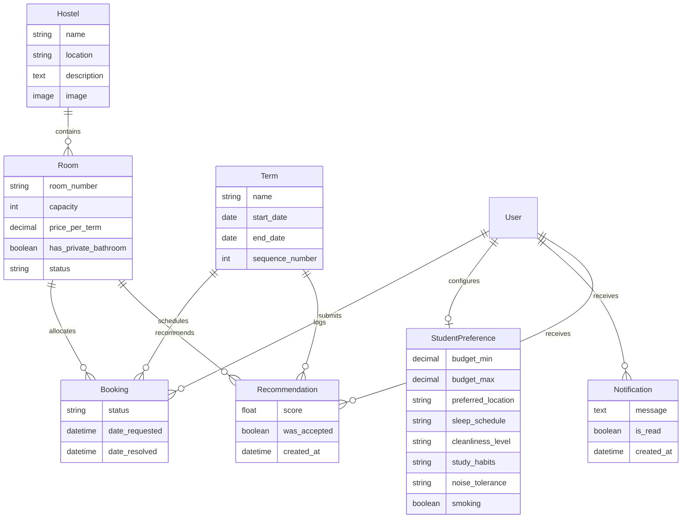

# 🏠 AI-Powered Hostel Booking & Management System

> **Undergraduate Degree Final Year Project** &middot; Zetech University  
> Built with **Django 6.0**, **Python 3.10+**, **SQLite**, and modern responsive CSS/JavaScript.

---

## 📌 Table of Contents

- [Overview](#-overview)
- [Key Features](#-key-features)
  - [1. AI-Powered Room Recommendation & Roommate Compatibility](#1-ai-powered-room-recommendation--roommate-compatibility)
  - [2. Role-Based Access Control (RBAC)](#2-role-based-access-control-rbac)
  - [3. Hostel, Room & Academic Term Management](#3-hostel-room--academic-term-management)
  - [4. Booking Lifecycle & Bed Allocation](#4-booking-lifecycle--bed-allocation)
  - [5. Staff Operational Dashboard & Demand Forecasting](#5-staff-operational-dashboard--demand-forecasting)
  - [6. Recommendation Analytics & Insights](#6-recommendation-analytics--insights)
  - [7. In-App Notifications & Communication](#7-in-app-notifications--communication)
  - [8. Modern, Responsive UI/UX](#8-modern-responsive-uiux)
- [System Architecture & Data Models](#-system-architecture--data-models)
  - [Data Model Overview](#data-model-overview)
  - [AI Recommendation & Matching Logic](#ai-recommendation--matching-logic)
  - [Demand Forecasting Logic](#demand-forecasting-logic)
- [Project Directory Structure](#-project-directory-structure)
- [Prerequisites](#-prerequisites)
- [Installation & Setup Guide](#-installation--setup-guide)
  - [Option A: One-Click Quick Start (Recommended)](#option-a-one-click-quick-start-recommended)
  - [Option B: Manual Step-by-Step Setup](#option-b-manual-step-by-step-setup)
- [Custom Management Commands](#-custom-management-commands)
- [Running Automated Tests](#-running-automated-tests)
- [Configuration & Settings](#-configuration--settings)
- [Future Enhancements & Roadmap](#-future-enhancements--roadmap)
- [License & Academic Declaration](#-license--academic-declaration)

---

## 📖 Overview

The **AI-Powered Hostel Booking & Management System** is a full-stack university accommodation platform designed to streamline student housing allocation, automate administrative tasks, and optimize student living experiences through intelligent recommendations and roommate compatibility scoring.

Traditional hostel allocation often relies on manual, first-come-first-served room assignments without considering students' budgets, habits, or interpersonal compatibility. This project addresses these inefficiencies with:
- **Personalized room matching** based on student financial and lifestyle preferences.
- **Roommate compatibility scoring** that evaluates sleep schedules, cleanliness habits, noise tolerance, study habits, and smoking preferences against current room occupants.
- **Predictive analytics** that forecast semester-by-semester demand for university hostel administration.
- **Robust Role-Based Access Control (RBAC)** providing distinct, secure interfaces for Administrators, Staff/Wardens, and Students.

---

## ✨ Key Features

### 1. AI-Powered Room Recommendation & Roommate Compatibility
- **Personalized Rankings**: Evaluates available rooms against the student's defined budget range, preferred location, and lifestyle parameters.
- **Roommate Fit Scoring**: When rooms have existing occupants, the algorithm compares the applicant's profile with current residents across:
  - 🌙 **Sleep Schedule** (*Early Bird*, *Night Owl*, *Flexible*)
  - 🧹 **Cleanliness Level** (*Low*, *Medium*, *High*)
  - 📚 **Study Habits** (*Quiet*, *Social*, *Group*)
  - 🔊 **Noise Tolerance** (*Low*, *Medium*, *High*)
  - 🚭 **Smoking Preferences** (*Yes* / *No*)
- **Overall Match Percentage**: Transparent match score visualizer and "Best Match" badges on room cards.

### 2. Role-Based Access Control (RBAC)
- **Admin**:
  - Full CRUD operations over Hostels, Rooms, and Academic Terms.
  - Access to the Django Admin portal (`/admin/`).
  - System-wide configuration and role assignment.
- **Staff / Hostel Warden**:
  - Operational dashboard with real-time occupancy and pending request metrics.
  - Review, approve, or reject student room booking requests.
  - View hostel demand forecasts and recommendation acceptance analytics.
  - Send broadcast announcements to all confirmed occupants of a hostel or direct messages to individual students.
- **Student**:
  - Browse hostels with photos, room pricing ranges, and live availability.
  - Filter and view individual rooms with bed availability calculations (`capacity - confirmed_bookings`).
  - Customize lifestyle and budget preferences.
  - Submit booking requests for available rooms in the active academic term.
  - Track booking history and cancel pending requests.
  - View in-app notifications and administrative messages.

### 3. Hostel, Room & Academic Term Management
- **Academic Terms (`Term`)**: Chronologically sequenced terms with strict date validation and automatic "Current Term" detection based on real-time dates.
- **Hostels (`Hostel`)**: Detailed hostel records with location details, rich descriptions, and photo upload support (`Pillow`).
- **Rooms (`Room`)**: Configurable room numbers, capacities, prices per term, private bathroom indicators, and operational status (`Available`, `Full`, `Under Maintenance`).

### 4. Booking Lifecycle & Bed Allocation
- **Strict Capacity Enforcement**: Prevents overbooking beyond room capacity.
- **Lifecycle States**: Track requests through `Pending` $\rightarrow$ `Confirmed`, `Rejected`, or `Cancelled`.
- **Duplicate Prevention**: Limits students to one active booking request per academic term.

### 5. Staff Operational Dashboard & Demand Forecasting
- **Live Metric Tiles**: Total vs. available rooms, pending request count, confirmed bookings for the current term, and overall recommendation acceptance rates.
- **Predictive Demand Forecasting**: Computes linear trend lines across completed terms to project booking volume for the upcoming academic term per hostel.

### 6. Recommendation Analytics & Insights
- Tracks how frequently students accept AI-recommended rooms versus browsing manually.
- Computes average compatibility scores for accepted vs. declined recommendations to validate recommendation efficacy.
- Displays term-by-term breakdown tables and progress meters.

### 7. In-App Notifications & Communication
- **Automated Alerts**: Generates instant notifications upon booking confirmation or rejection.
- **Hostel Broadcasts**: Staff can dispatch messages to all residents of a particular hostel in one click.
- **Notification Center**: Interactive navigation bell with unread badge count and auto-marking as read upon viewing.

### 8. Modern, Responsive UI/UX
- Custom CSS design system with CSS custom properties (variables).
- **Auto Light/Dark Theme** adapted to operating system settings (`prefers-color-scheme`).
- Semantic HTML5, accessible skip links, interactive dropdowns, and responsive navigation for mobile and desktop screens.

---

## 🏛️ System Architecture & Data Models

### Data Model Overview



### AI Recommendation & Matching Logic

The recommender evaluates each candidate room $R$ for student preference $P$ in academic term $T$ using a weighted composite score:

$$\text{Overall Score} = w_b \cdot S_{\text{budget}} + w_l \cdot S_{\text{location}} + w_c \cdot S_{\text{compatibility}}$$

1. **Budget Score ($S_{\text{budget}}$)**:
   - Within range ($\text{budget\_min} \le \text{price} \le \text{budget\_max}$): **1.0**
   - Below budget ($\text{price} < \text{budget\_min}$): **0.85** (affordable, minor penalty)
   - Above budget ($\text{price} > \text{budget\_max}$): Exponential decay towards **0.0** based on overrun percentage.
2. **Location Score ($S_{\text{location}}$)**:
   - Exact location match: **1.0**
   - No location specified: **0.5** (neutral)
   - Different location: **0.2**
3. **Roommate Compatibility Score ($S_{\text{compatibility}}$)**:
   - For empty rooms: Returns neutral/baseline score.
   - For occupied rooms: Averages pairwise compatibility across sleep schedules, cleanliness levels, study habits, noise tolerance, and smoking preferences of all confirmed occupants.

### Demand Forecasting Logic

The demand forecasting engine analyzes historical booking counts for completed academic terms ($t_1, t_2, \dots, t_n$) per hostel:
- Filters out currently ongoing terms (to prevent incomplete data distortion).
- Fits a linear regression trend line over chronological term sequence numbers.
- Computes predicted next-term occupancy and classifies trend trajectory (`rising`, `steady`, or `falling`).

---

## 📁 Project Directory Structure

```
undergrad-project/
├── dev/
│   ├── config/                     # Django project configuration & root URLs
│   │   ├── __init__.py
│   │   ├── asgi.py
│   │   ├── settings.py             # Project settings, middleware, auth & apps
│   │   ├── urls.py                 # Top-level URL routing
│   │   └── wsgi.py
│   │
│   ├── hostels/                    # Hostels, Rooms & Academic Terms App
│   │   ├── migrations/             # Database migrations
│   │   ├── admin.py                # Django admin model registrations
│   │   ├── apps.py
│   │   ├── forms.py                # Model forms for Hostel, Room & Term CRUD
│   │   ├── models.py               # Hostel, Room & Term models
│   │   ├── urls.py                 # URL patterns for browsing and admin management
│   │   └── views.py                # Views for browsing, availability & CRUD
│   │
│   ├── accounts/                   # Authentication & Student Preferences App
│   │   ├── models.py               # StudentPreference model
│   │   ├── context_processors.py   # Injects user roles into templates
│   │   └── urls.py
│   │
│   ├── bookings/                   # Bookings, Recommender, Analytics & Notifications
│   │   ├── models.py               # Booking, Notification & Recommendation models
│   │   ├── recommender.py          # AI Room Recommendation & Roommate Compatibility Engine
│   │   ├── analytics.py            # Operational analytics & forecasting algorithms
│   │   ├── context_processors.py   # Injects unread notification counts
│   │   └── urls.py
│   │
│   ├── static/                     # Static assets
│   │   ├── css/
│   │   │   └── style.css           # Custom responsive stylesheet (Light/Dark mode)
│   │   └── js/
│   │       └── nav.js              # Accessible mobile menu and dropdown handlers
│   │
│   ├── templates/                  # Django HTML templates
│   │   ├── base.html               # Base layout, navigation, flash messages & footer
│   │   ├── home.html               # Landing page with hero stats and role quick-links
│   │   ├── 404.html                # Custom 404 error page
│   │   ├── 500.html                # Custom 500 error page
│   │   ├── accounts/               # Profile and preference editing templates
│   │   ├── bookings/               # Dashboard, forecasts, insights, recommendations & messages
│   │   ├── hostels/                # Hostel browse, room listings & admin manage forms
│   │   └── registration/           # Login & auth templates
│   │
│   ├── tests/                      # Automated unit and integration test suite
│   │   ├── test_analytics.py       # Recommendation metrics & analytics tests
│   │   ├── test_dashboard.py       # Staff dashboard tests
│   │   ├── test_error_pages.py     # HTTP 404 & 500 handler tests
│   │   ├── test_hostel_browse.py   # Public/student browse view tests
│   │   ├── test_hostel_management.py # Admin hostel and room CRUD tests
│   │   ├── test_hostels.py         # Room capacity, status & term tests
│   │   ├── test_notifications.py   # Notification generation & delivery tests
│   │   ├── test_rbac.py            # Role & permission boundary tests
│   │   ├── test_recommender.py     # AI recommendation algorithm unit tests
│   │   ├── test_seed_demo_data.py  # Demo seeder tests
│   │   └── test_term_management.py # Academic term CRUD & validation tests
│   │
│   ├── manage.py                   # Django CLI management script
│   └── requirements.txt            # Python dependencies (Django, Pillow)
│
├── scripts/
│   ├── setup_windows.bat           # Windows one-click environment setup & server launcher
│   └── setup_linux.sh              # Linux/macOS setup & server launcher script
│
└── README.md                       # Master project documentation
```

---

## ⚙️ Prerequisites

Ensure you have the following installed on your system:
- **Python 3.10** or higher ([Download Python](https://www.python.org/downloads/))
- **pip** (Python package installer)
- **Git** ([Download Git](https://git-scm.com/))
- (Optional) Modern web browser (Chrome, Firefox, Edge, Safari)

---

## 🚀 Installation & Setup Guide

### Option A: One-Click Quick Start (Recommended)

Automated scripts are provided in the `scripts/` directory to create a virtual environment, install dependencies, run migrations, set up RBAC roles, and launch the server.

#### On Windows:
1. Open Command Prompt or PowerShell.
2. Run the Windows launcher script:
   ```cmd
   scripts\setup_windows.bat
   ```
   *Alternatively, simply double-click `scripts/setup_windows.bat` in Windows File Explorer.*

#### On Linux / macOS:
1. Open your terminal.
2. Grant execution permissions and run the Linux/macOS launcher script:
   ```bash
   chmod +x scripts/setup_linux.sh
   ./scripts/setup_linux.sh
   ```

---

### Option B: Manual Step-by-Step Setup

If you prefer to configure the environment manually, follow these steps:

#### 1. Clone the Repository
```bash
git clone <repository-url>
cd undergrad-project
```

#### 2. Navigate to the `dev` Directory
```bash
cd dev
```

#### 3. Create and Activate a Virtual Environment
- **On Windows (PowerShell / Command Prompt)**:
  ```powershell
  python -m venv venv
  .\venv\Scripts\activate
  ```
- **On Linux / macOS**:
  ```bash
  python3 -m venv venv
  source venv/bin/activate
  ```

#### 4. Upgrade pip and Install Dependencies
```bash
pip install --upgrade pip
pip install -r requirements.txt
```

#### 5. Apply Database Migrations
```bash
python manage.py migrate
```

#### 6. Initialize RBAC User Groups & Permissions
Run the role configuration command to create the `Admin`, `Staff`, and `Student` groups with their respective permission sets:
```bash
python manage.py setup_roles
```

#### 7. (Optional) Populate Demo Data
To test recommendations, historical bookings, terms, hostels, rooms, and forecasting dashboards with realistic sample data:
```bash
python manage.py seed_demo_data
```
*(To reset demo data at any time, run `python manage.py seed_demo_data --reset`)*

#### 8. Create an Administrator Superuser
```bash
python manage.py createsuperuser
```
Follow the prompts to enter a username, email, and password.

#### 9. Start the Development Server
```bash
python manage.py runserver
```

#### 10. Access the Application
Open your browser and navigate to:
- **Main Web Application**: [http://127.0.0.1:8000/](http://127.0.0.1:8000/)
- **Django Admin Portal**: [http://127.0.0.1:8000/admin/](http://127.0.0.1:8000/admin/)

---

## 🛠️ Custom Management Commands

| Command | Purpose |
| :--- | :--- |
| `python manage.py setup_roles` | Idempotently creates the `Admin`, `Staff`, and `Student` auth groups and assigns granular model permissions. Safe to re-run. |
| `python manage.py seed_demo_data` | Seeds sample academic terms, hostels, rooms, student accounts with preferences, and historical bookings for testing analytics and forecasting. |
| `python manage.py seed_demo_data --reset` | Flushes existing demo data and re-seeds clean demo records. |

---

## 🧪 Running Automated Tests

The project includes an extensive test suite covering models, views, RBAC permissions, recommender scoring, forecasting calculations, and notification pipelines.

To run all automated tests:
```bash
python manage.py test
```

To run a specific test module:
```bash
# Test AI Recommendation engine
python manage.py test tests.test_recommender

# Test Role-Based Access Control
python manage.py test tests.test_rbac

# Test Operational Dashboard & Stats
python manage.py test tests.test_dashboard

# Test Analytics & Forecasting
python manage.py test tests.test_analytics

# Test Notifications & Messaging
python manage.py test tests.test_notifications

# Test Hostel & Room Management
python manage.py test tests.test_hostel_management
```

> **Note on Test Performance**: In `config/settings.py`, an MD5 password hasher is activated during test runs to ensure rapid execution when testing bulk user creation and role assignments.

---

## 🔧 Configuration & Settings

Key configuration options are located in `dev/config/settings.py`:

- **Database**: Defaults to `sqlite3` at `dev/db.sqlite3`. Can be switched to PostgreSQL or MySQL for production deployment by updating `DATABASES`.
- **Media Files**: User-uploaded hostel photos are stored in `dev/media/hostels/` (`MEDIA_ROOT`) and served under `/media/` (`MEDIA_URL`).
- **Time Zone**: Configured to `'Africa/Nairobi'` with `USE_TZ = True`.
- **Static Files**: Consolidated under `dev/static/`.

---

## 🔮 Future Enhancements & Roadmap

- 💳 **M-Pesa / Mobile Payment Integration**: Direct in-app payment of hostel fees via the Daraja STK Push API.
- 📱 **SMS & Email Gateway**: Automated SMS notifications (e.g. via Africa's Talking) for booking status updates.
- 🗺️ **Interactive Campus Map**: Visual hostel floor plans and map integration showing distance to campus lecture halls.
- 🤖 **Deep Learning Embeddings**: Enhanced preference embeddings for multi-criteria roommate clustering.

---

## 📄 License & Academic Declaration

This project was developed as a final-year undergraduate degree capstone project at **Zetech University**.  
All rights reserved &copy; 2026.
